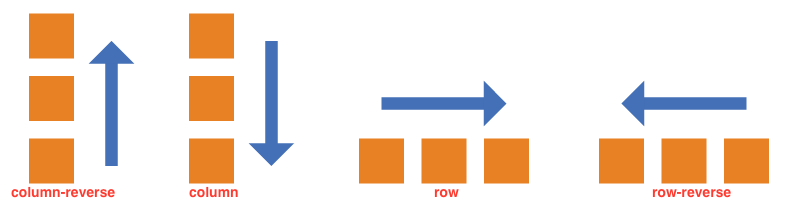

#Flex布局

## 一、介绍

Flex，弹性布局。任何一个容器都可定义为Flex布局


```
.box {
	display:flex;
}

.box {
	display:inline-flex;
}
```
Webkit内核浏览器必须加上-webkit前缀。

```
.box {
	display:-webkit-flex;
	display:flex;
}
```

**设为Flex布局后，子元素的float、clear和vertical-align失效**


## 二、概念

采用Flex布局的元素，称为Flex容器，其所有子元素自动成为容器成员，成为Flex项目。


容器默认存在两根轴： 

*  水平的主轴 mian axis
*  垂直的交叉轴 cross axis

单个项目占据的主轴空间： main size； 垂直轴空间： cross size  
  

## 三、容器属性

以下六种属性设置在容器上：

* flex-direction
* flex-wrap
* flex-flow
* justify-content
* align-items
* align-content

### 3.1 flex-direction  -   决定主轴方向（即项目排列方向）

```
.box {
	flex-direction : row（默认） | row-reverse | clolumn | column-reverse
}
```




### 3.2 flex-wrap  - 决定如何换行

默认情况下项目都排在一条轴线上，flex-wrap定义如果一行排不下如何换行

```
	.box {
		flex-wrap: nowrap（默认） | wrap | wrap-reverse
	}

```

1. nowrap(默认)：不换行
2. wrap：换行，第一行在上方

3. wrap-reverse： 换行，第一行在下方


### 3.3 flex-flow - flex-direaction 和 flex-wrap的简写，默认 row nowrap

### 3.4 justify-content  - 决定项目在主轴上的对齐方式

```
	.box {
		justify-content : flex-start | flex-end | center | space-between | space-between 
	}
```
其中：

1. space-between 两端对齐，项目之间的间隔相等
2. space-around 每个项目两侧的间隔相等，so，项目之间间距为项目到边框的2倍


### 3.5 align-items属性 - 决定项目在交叉轴上如何对齐

.box {
	flex-start | flex-end | center | stretch （默认） | baseline 
}


其中：

1. stretch  如果项目未设置高度或设为auto，将占满整个容器的高度
2. baseline: 项目的第一行文字的基线对齐。


### 3.6 align-content 多根轴线的对齐方式

align-content属性定义了多根轴线的对齐方式。如果项目只有一根轴线，该属性不起作用。

```
.box {
  align-content: flex-start | flex-end | center | space-between | space-around | stretch（默认）;
}
```


## 四、项目的属性

以下六个属性在项目上

* order
* flex-grow
* flex-shrink

